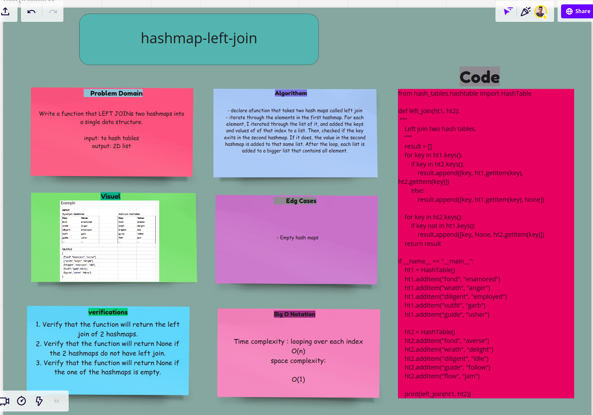

# Hash tables
<!-- Short summary or background information -->
- The hash table is implemented in python and the collision is handled by the chaining method.
- do the implementation of the hash table in python and handle the collision case

## Challenge
<!-- Description of the challenge -->
- do the implementation of the hash table in python and handle the collision case
- add the hash functions add, remove, contains, and get
- do the testing of the hash table

## Approach & Efficiency
<!-- What approach did you take? Why? What is the Big O space/time for this approach? -->
- Test driven development (TDD)

## API
<!-- Description of each method publicly available in each of your hashtable -->
- add(key, value): adds a key-value pair to the hash table
- remove(key) : removes a key from the hash table
- contains(key): contains a key in the hash table
- get(key): gets the key from the hash table
- hash(key): hashes the key and return index

# code challenge31: hash table implementation hashmap-repeated-word

<!-- Short summary or background information -->
Write a function called repeated word that finds the first word to occur more than once in a string
input => string with words
output => first word to occur more than once

- example:
input: "I am a cat and I am a dog"
output: "I"

## Challenge
<!-- Description of the challenge -->
- do the implementation of the hash table in python and handle the collision case
- find word to occur more than once in a string

## Approach & Efficiency
<!-- What approach did you take? Why? What is the Big O space/time for this approach? -->
- Test driven development (TDD)

## API
<!-- Description of each method publicly available in each of your hashtable -->
- hashmap-repeated-word (string): returns the first word to occur more than once in a string.

## Miro

[White Board Image](https://miro.com/app/board/o9J_lyoZoEU=/)

# code challenge32: hashmap-tree-intersection
<!-- Short summary or background information -->
Write a function called tree-intersection that takes two linked list and push the intersection between the trees to list and return the list

input: two binary trees
output: list

## Challenge
<!-- Description of the challenge -->
Write a function called tree-intersection that takes two linked list and push the intersection between the trees to list and return the list

## Approach & Efficiency
<!-- What approach did you take? Why? What is the Big O space/time for this approach? -->
- Test driven development (TDD)

## API
<!-- Description of each method publicly available in each of your hashtable -->
- hashmap-tree-intersection(tree1, tree2): returns two binary trees.

## Miro

[White Board Image](https://miro.com/app/board/o9J_lyoZoEU=/)

# code challenge33: hashmap-left-join
<!-- Short summary or background information -->
Write a function that LEFT JOINs two hashmaps into a single data structure.

input: to hash tables
output: 2D list

## Challenge
<!-- Description of the challenge -->
Write a function that LEFT JOINs two hashmaps into a single data structure.

## Approach & Efficiency
<!-- What approach did you take? Why? What is the Big O space/time for this approach? -->
- declare a function that takes two hash maps called left join
- iterate through the elements in the first hashmap. For each element, I iterated through the list of it, and added the keys and values of of that index to a list. Then, checked if the key exits in the second hashmap. If it does, the value in the second hashmap is added to that same list. After the loop, each list is added to a bigger list that contains all element.
- Test driven development (TDD)

## API
<!-- Description of each method publicly available in each of your hashtable -->
- hashmap-left-join(ht1, ht2): returns 2D list

## Miro

[White Board Image](https://miro.com/app/board/o9J_lyoZoEU=/)

