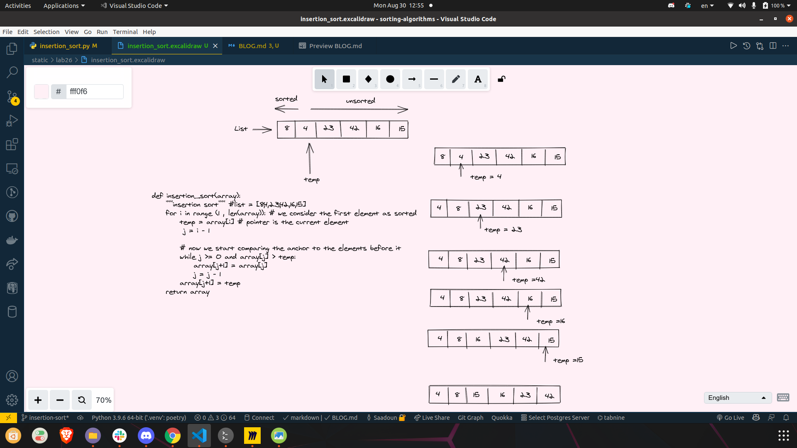

# Insertion Sort

## Insertion Sort pseudo code

pseudo code for insertion sort:
    ```
        InsertionSort(int[] arr)

        FOR i = 1 to arr.length

        int j <-- i - 1
        int temp <-- arr[i]

        WHILE j >= 0 AND temp < arr[j]
            arr[j + 1] <-- arr[j]
            j <-- j - 1

        arr[j + 1] <-- temp
    ```

python code for insertion sort:

```
def insertion_sort(array):
    """insertion sort""" #list = [8,4,23,42,16,15]
    for i in range (1 , len(array)): # we consider the first element as sorted
        temp = array[i] # pointer is the current element
        # now we start comparing the anchor to the elements before it
        j = i - 1
        while j >= 0 and array[j] > temp:
            array[j+1] = array[j]
            j = j - 1
        array[j+1] = temp
    return array
```


## Insertion Sort visually

- You can see the file thats shows the visual of the insertion sort as drawing inside static/lab26.
- image: to see the image go to static/lab26/visual_insertion_sort.png



## Miro link

Miro: <https://miro.com/app/board/o9J_l0dN_jE=/>
