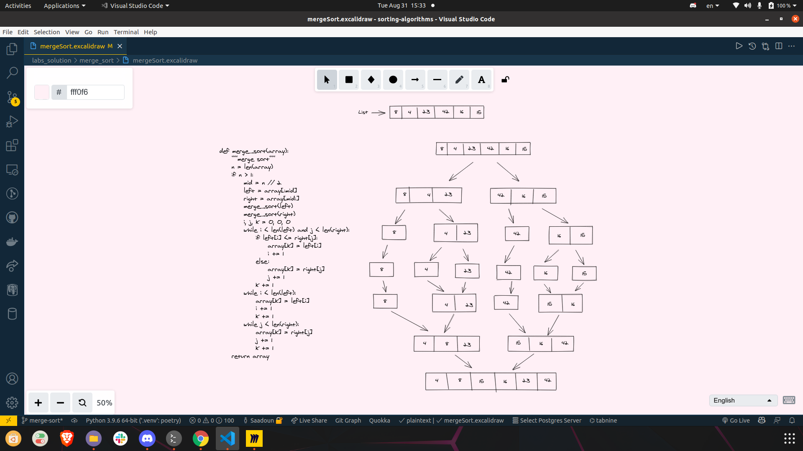

# merge Sort

## merge Sort pseudo code

pseudo code for insertion sort:
    ```
    
    ALGORITHM Mergesort(arr)
        DECLARE n <-- arr.length

        if n > 1
        DECLARE mid <-- n/2
        DECLARE left <-- arr[0...mid]
        DECLARE right <-- arr[mid...n]
        # sort the left side
        Mergesort(left)
        # sort the right side
        Mergesort(right)
        # merge the sorted left and right sides together
        Merge(left, right, arr)

    ALGORITHM Merge(left, right, arr)
        DECLARE i <-- 0
        DECLARE j <-- 0
        DECLARE k <-- 0

        while i < left.length && j < right.length
            if left[i] <= right[j]
                arr[k] <-- left[i]
                i <-- i + 1
            else
                arr[k] <-- right[j]
                j <-- j + 1

            k <-- k + 1

        if i = left.length
        set remaining entries in arr to remaining values in right
        else
        set remaining entries in arr to remaining values in left
    ```

python code for insertion sort:

```
def merge_sort(array):
    """merge sort""" 
    n = len(array)
    if n > 1:
        mid = n // 2
        left = array[:mid]
        right = array[mid:]
        merge_sort(left)
        merge_sort(right)
        i, j, k = 0, 0, 0
        while i < len(left) and j < len(right):
            if left[i] <= right[j]:
                array[k] = left[i]
                i += 1
            else:
                array[k] = right[j]
                j += 1
            k += 1
        while i < len(left):
            array[k] = left[i]
            i += 1
            k += 1
        while j < len(right):
            array[k] = right[j]
            j += 1
            k += 1
    return array
```

## Challenge Summary
<!-- Description of the challenge -->
Write a function that implements the quick sort algorithm
the function takes a list and start of the lest and the end of the list and return the list sorted

- Note:  Im using Hoare schema partition to do the quick sort

## Whiteboard Process
<!-- Embedded whiteboard image -->



## Miro link

Miro: <https://miro.com/app/board/o9J_l0dN_jE=/>

## Approach & Efficiency
<!-- What approach did you take? Why? What is the Big O space/time for this approach? -->
- to sort an array has n elements in descending order using quick sort algorithm
- first we found the write index for the pivot where there will be two partitions
- after we have the partitions and index of the pivot we can use that to use recurion to repeat the process and keep doing that until  the start of the array is greater than the end of the array

## Solution
<!-- Show how to run your code, and examples of it in action -->
"""
    poetry install
    poetry run python quick_sort.py
"""

## merge Sort visually

- image: to see the image go to static/lab27/merge_Sort


## Miro link

Miro: <https://miro.com/app/board/o9J_l0dN_jE=/>
