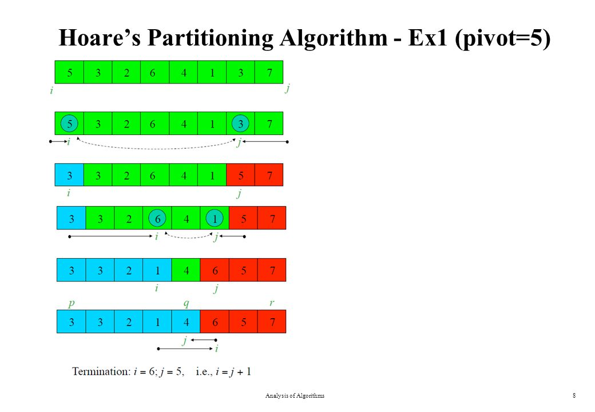
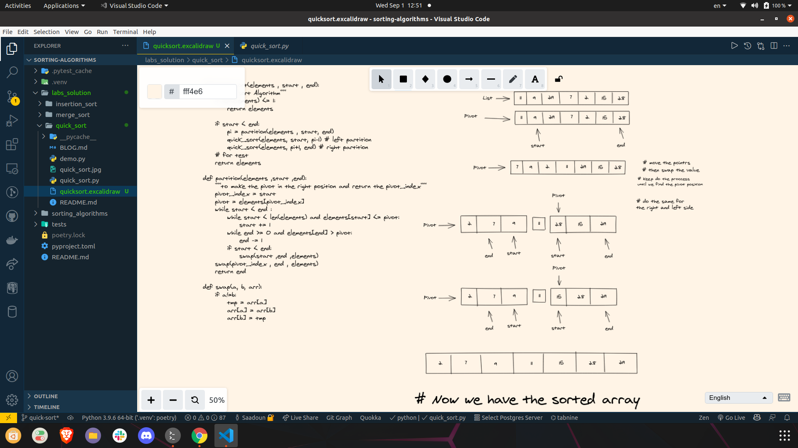

# Quick Sort

## Quick Sort pseudo code

pseudo code for quick sort:
```
ALGORITHM QuickSort(arr, left, right)
    if left < right
        // Partition the array by setting the position of the pivot value
        DEFINE position <-- Partition(arr, left, right)
        // Sort the left
        QuickSort(arr, left, position - 1)
        // Sort the right
        QuickSort(arr, position + 1, right)

ALGORITHM Partition(arr, left, right)
    // set a pivot value as a point of reference
    DEFINE pivot <-- arr[right]
    // create a variable to track the largest index of numbers lower than the defined pivot
    DEFINE low <-- left - 1
    for i <- left to right do
        if arr[i] <= pivot
            low++
            Swap(arr, i, low)

     // place the value of the pivot location in the middle.
     // all numbers smaller than the pivot are on the left, larger on the right.
     Swap(arr, right, low + 1)
    // return the pivot index point
     return low + 1

ALGORITHM Swap(arr, i, low)
    DEFINE temp;
    temp <-- arr[i]
    arr[i] <-- arr[low]
    arr[low] <-- temp
```

python code for quick sort:

```
def quick_sort(elements , start , end):
    """quick sort Algorithm"""
    if len(elements) <= 1:
        return elements
    if start < end:
        pi = partition(elements , start, end)
        quick_sort(elements, start, pi-1) # left partition
        quick_sort(elements, pi+1, end) # right partition

def partition(elements ,start ,end):
    """to make the pivot in the right position and return the pivot_index"""
    pivot_index = start
    pivot = elements[pivot_index]
    while start < end :
        while start < len(elements) and elements[start] <= pivot:
            start += 1
        while end >= 0 and elements[end] > pivot:
            end -= 1  
        if start < end:
            swap(start ,end ,elements)
    swap(pivot_index , end , elements)
    return end
    
def swap(a, b, arr):
    if a!=b:
        tmp = arr[a]
        arr[a] = arr[b]
        arr[b] = tmp

if __name__ == "__main__":
    elements = [11,9,29,7,2,15,28]
    print(elements)
    quick_sort(elements ,0 , len(elements)-1)
    print(elements)

    a = [2, 1, 3, 4, 5, 6, 7, 8, 9, 10]
    quick_sort(a, 0, len(a)-1)
    print(a)
```
# Challenge Summary
<!-- Description of the challenge -->
Write a function that implements the quick sort algorithm
the function takes a list and start of the lest and the end of the list and return the list sorted

- Note:  Im using Hoare schema partition to do the quick sort

## Whiteboard Process
<!-- Embedded whiteboard image -->




## Miro link

Miro: <https://miro.com/app/board/o9J_l0dN_jE=/>

## Approach & Efficiency
<!-- What approach did you take? Why? What is the Big O space/time for this approach? -->
- to sort an array has n elements in descending order using quick sort algorithm
- first we found the write index for the pivot where there will be two partitions
- after we have the partitions and index of the pivot we can use that to use recurion to repeat the process and keep doing that until  the start of the array is greater than the end of the array

## Solution
<!-- Show how to run your code, and examples of it in action -->
```
    poetry install
    poetry run python quick_sort.py
```
