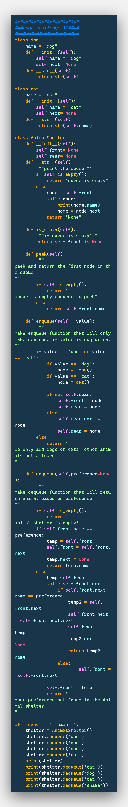

# **```#code challenge 10#```**

# Stacks and Queues
<!-- we are implementing stack and queue here then we are writing tests to check our work-->

## Challenge
<!-- implementing stack and queue -->

## Approach & Efficiency
<!-- What approach did you take? Why? What is the Big O space/time for this approach? -->
- TDD: its faster for simple problem like this

## API
<!-- Description of each method publicly available to your Stack and Queue-->

### class Stack()

1- push the element to the top of the stack
2- pop the element from the top of the stack
3- peek the element from the top of the stack
4- check if the stack is empty

### class Queue()

1- enqueue the element to the end of the queue
2- dequeue the element from the end of the queue
3- peek the element from the end of the queue
4- check if the queue is empty

</hr>

# **```#code challenge 11#```**
# Challenge Summary
<!-- Description of the challenge -->
- **the problem domain is:**
- making pseudo queue using two stacks
## Whiteboard Process
<!-- Embedded whiteboard image -->
<https://miro.com/app/board/o9J_l3fv6os=/>

<!--  -->
## Approach & Efficiency
<!-- What approach did you take? Why? What is the Big O space/time for this approach? -->
- enqueue to the queue is O(1)
- dequeue from the queue is O(n)

## Solution
<!-- Show how to run your code, and examples of it in action -->
- go to the file and run the python module
```python -m path/module_name```

## Checklist

- [ done ] Top-level README “Table of Contents” is updated
- [ done ] README for this challenge is complete
- [ done ] Summary, Description, Approach & Efficiency, Solution
- [ done ] Picture of whiteboard
- [ done ] Link to code
- [ done ] Feature tasks for this challenge are completed
- [ done ] Unit tests written and passing
- [ done ] “Happy Path” - Expected outcome
- [ done ] Expected failure
- [ done ] Edge Case (if applicable/obvious)

</hr>

# **```#code challenge 12#```**

# Challenge Summary
<!-- Description of the challenge -->
- we are building animal shelter thats following the FIFO principle
- we can enqueue a new animal to the shelter (dog or cat)
- we can dequeue an animal from the shelter (dog or cat) based on or preference

## Whiteboard Process
<!-- Embedded whiteboard image -->
<https://miro.com/app/board/o9J_l3fv6os=/>

<!--  -->
## Approach & Efficiency
<!-- What approach did you take? Why? What is the Big O space/time for this approach? -->
- adding to the queue is O(1)
- removing from the queue is O(n)

## Solution
<!-- Show how to run your code, and examples of it in action -->
- go to the file and run the python module
```python -m path/module_name```

## Checklist

- [ done ] Top-level README “Table of Contents” is updated
- [ done ] README for this challenge is complete
- [ done ] Summary, Description, Approach & Efficiency, Solution
- [ done ] Picture of whiteboard
- [ done ] Link to code
- [ done ] Feature tasks for this challenge are completed
- [ done ] Unit tests written and passing
- [ done ] “Happy Path” - Expected outcome
- [ done ] Expected failure
- [ done ] Edge Case (if applicable/obvious)

</hr>

# **```#code challenge 13#```**

# Challenge Summary

- write a function to that takes a string and that includes brackets and return true if the brackets are balanced and false if they are not.
- for example: if the string is "((5+3)*(9-7))" then the function should return true.
- if the string is "(((3+1)+2)*3)" then the function should return false.
- we have three types of brackets () {} []

## Whiteboard Process
<!-- Embedded whiteboard image -->
<https://miro.com/app/board/o9J_l3fv6os=/>

<!--  -->
## Approach & Efficiency
<!-- What approach did you take? Why? What is the Big O space/time for this approach? -->
- removing from the stack is O(n)

## Solution
<!-- Show how to run your code, and examples of it in action -->
- go to the file and run the python module
```python -m path/module_name```

## Checklist

- [ done ] Top-level README “Table of Contents” is updated
- [ done ] README for this challenge is complete
- [ done ] Summary, Description, Approach & Efficiency, Solution
- [ done ] Picture of whiteboard
- [ done ] Link to code
- [ done ] Feature tasks for this challenge are completed
- [ done ] Unit tests written and passing
- [ done ] “Happy Path” - Expected outcome
- [ done ] Expected failure
- [ done ] Edge Case (if applicable/obvious)

</hr>

# **```#code challenge 14#```**
 <!-- working on it -->

</hr>

# **```#code challenge 15#```**
 <!-- working on it -->